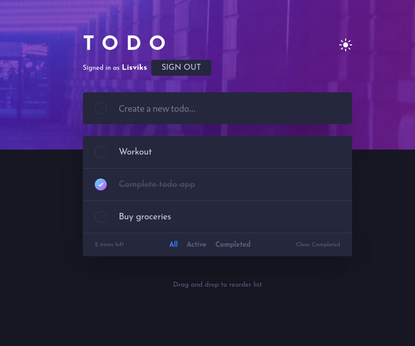
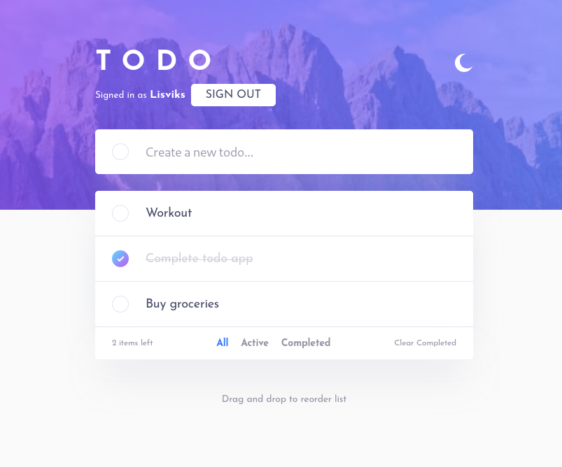

# Frontend Mentor - Todo app solution

This is a solution to the [Todo app challenge on Frontend Mentor](https://www.frontendmentor.io/challenges/todo-app-Su1_KokOW). Frontend Mentor challenges help you improve your coding skills by building realistic projects.

## Getting Started

First update `.env.local.example` and then rename it to `.env.local`. After that start development server:

```bash
npm run dev
# or
yarn dev
# or
pnpm dev
```

## Table of contents

- [Overview](#overview)
  - [The challenge](#the-challenge)
  - [Screenshot](#screenshot)
  - [Links](#links)
- [My process](#my-process)
  - [Built with](#built-with)
  - [Useful resources](#useful-resources)
- [Author](#author)

## Overview

### The challenge

Users should be able to:

- View the optimal layout for the app depending on their device's screen size
- See hover states for all interactive elements on the page
- Add new todos to the list
- Mark todos as complete
- Delete todos from the list
- Filter by all/active/complete todos
- Clear all completed todos
- Toggle light and dark mode
- **Bonus**: Drag and drop to reorder items on the list

### Screenshot




### Links

- Solution URL: [URL](https://www.frontendmentor.io/solutions/todo-app-LSb8qAkBCF)
- Live Site URL: [URL](https://todo-app-frontendmentor-nine.vercel.app/)

## My process

### Built with

- CSS custom properties
- Flexbox
- CSS Grid
- Mobile-first workflow
- [Next.js](https://nextjs.org/) - React framework
- [NextAuth](https://next-auth.js.org) - Authentication
- [MongoDB](https://www.mongodb.com/) - Database
- [React-beautiful-dnd](https://github.com/atlassian/react-beautiful-dnd) - Drag and drop
- [SASS](https://sass-lang.com/)
- [Typescript](https://www.typescriptlang.org/)

### Useful resources

- [NextJS](https://nextjs.org/docs)
- [NextAuth](https://next-auth.js.org/getting-started/introduction) - Used it for authentication
- [Modal SignIn](https://github.com/nextauthjs/next-auth/issues/178#issuecomment-757513968) - This helped me to make a modal signin
- [NextJS/Router](https://stackoverflow.com/a/57909885) - This stackoverflow answer helped me with signin modal
- [MongoDB](https://www.mongodb.com/docs/drivers/node/current/) - MongoDB Node.js docs
- [Sort array based on another array](https://stackoverflow.com/a/44063445) - This helped me with reordering todos and saving new order
- [react-beautiful-dnd](https://egghead.io/lessons/react-course-introduction-beautiful-and-accessible-drag-and-drop-with-react-beautiful-dnd) - This helped me to implement drag and drop using `react-beautiful-dnd`
- [Context/Reducer](https://react.dev/learn/scaling-up-with-reducer-and-context) - This helped me to use context and recuder
- [Gradient border color](https://codyhouse.co/nuggets/css-gradient-borders) - Helped me to add gradient border color

## Author

- Website - [Add your name here](https://deividas.blog)
- Frontend Mentor - [@Lisviks](https://www.frontendmentor.io/profile/Lisviks)
- Twitter - [@DRimkusDev](https://www.twitter.com/DRimkusDev)
- GitHub - [Lisviks](https://github.com/Lisviks)
